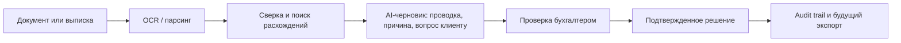

# AI-Бухгалтер

**AI-Бухгалтер** — это продуктовая концепция и архитектурное досье платформы
для бухгалтерского аутсорсинга.

Идея продукта простая: дать бухгалтеру и руководителю один рабочий контур, где
собраны клиенты, первичные документы, банковские операции, расхождения, задачи,
сроки, AI-подсказки и история подтверждений.

AI не заменяет бухгалтера. Он распознает, сопоставляет, подсказывает,
приоритизирует и объясняет. Финальное решение остается за человеком.

> Это публичный портфолио-репозиторий. Здесь нет исходного кода, токенов,
> паролей, клиентских данных, приватных ссылок и внутренних промптов.

## Как Это Работает

## Для Кого

- бухгалтерские компании на аутсорсинге;
- руководители бухгалтерских групп;
- бухгалтеры, которые ведут много юридических лиц;
- команды, которые хотят меньше ручной сверки и больше управляемости;
- компании, которым важно видеть состояние документов, платежей и сроков без
  хаоса в папках, мессенджерах и таблицах.

## Главная Польза

AI-Бухгалтер превращает разрозненную работу с документами и выписками в
управляемый операционный процесс:

- документы попадают в единый контур;
- реквизиты и суммы извлекаются автоматически;
- банковские операции нормализуются и сопоставляются с документами;
- расхождения превращаются в задачи;
- AI предлагает проводки и вопросы клиенту;
- бухгалтер проверяет, подтверждает или исправляет;
- руководитель видит загрузку, просрочки, риски и качество работы.

## Принцип Продукта

**AI предлагает, бухгалтер подтверждает.**

Платформа не должна принимать налоговые, бухгалтерские или юридически значимые
решения самостоятельно. Любой существенный результат должен иметь:

- источник данных;
- уверенность распознавания или сопоставления;
- объяснение логики;
- статус проверки;
- ответственного человека;
- журнал действий.

## Ключевые Документы

- [Описание продукта](./docs/ru/product.md)
- [Возможности](./docs/ru/features.md)
- [Архитектура](./docs/ru/architecture.md)
- [Сценарии использования](./docs/ru/use-cases.md)
- [Human-in-the-loop](./docs/ru/human-in-the-loop.md)
- [Ограничения продукта](./docs/ru/limitations.md)
- [Модель AI-рисков](./docs/ru/ai-risk-model.md)
- [Бизнес-ценность](./docs/ru/business-value.md)
- [Сквозной сценарий](./docs/ru/user-journey.md)
- [Evidence model](./docs/ru/evidence-model.md)
- [Рыночный контекст](./docs/ru/market-context.md)
- [Для партнеров](./docs/ru/for-partners.md)
- [Интеграционная карта](./docs/ru/integrations.md)
- [Метрики пилота](./docs/ru/metrics.md)
- [Безопасность и соответствие](./docs/ru/security.md)
- [Roadmap](./docs/ru/roadmap.md)
- [Статус продукта](./docs/ru/status.md)
- [FAQ](./docs/ru/faq.md)
- [Changelog](./CHANGELOG.md)

## Состояние

Пилотный продуктовый контур уже спроектирован и частично реализован в приватной
рабочей версии:

- публичный сайт;
- вход в рабочую панель;
- дашборд клиентов;
- загрузка документов;
- OCR/PDF-контур через отдельный сервис;
- импорт и нормализация банковских данных;
- базовая сверка;
- черновики проводок с подтверждением человеком;
- задачи и сроки;
- контур безопасности и архитектурные решения.

Промышленный запуск требует отдельного этапа: постоянное хранилище документов,
резервные копии, MFA, расширенные роли, юридическая проверка 152-ФЗ, реальные
интеграции с 1С, ЭДО, банками, ФНС и email.

## Product Maturity

| Слой | Статус |
| --- | --- |
| Продуктовая концепция | определена |
| Приватный пилотный контур | частично реализован |
| Публичная документация | опубликована |
| Production-ready платформа | roadmap |
| Исходный код | приватный |

## Что Репозиторий Не Содержит

- исходный код продукта;
- реальные клиентские документы;
- ключи API и токены;
- пароли и данные доступа;
- внутренние инфраструктурные адреса;
- приватные бизнес-договоренности.

## Для Партнеров

Репозиторий открыт для обсуждения пилота, партнерства и архитектурного ревью
AI-автоматизации бухгалтерских процессов.

- Telegram: [@a_malishev](https://t.me/a_malishev)
- GitHub: [Gudvin82](https://github.com/Gudvin82)

## Методология

Досье собрано в стиле product engineering:

- [Vibe Coding Protocols](https://github.com/Gudvin82/vibe-coding-protocols):
  намерение, контроль, доказательства, gates;
- сильная инженерная практика: контракты, сервисные границы, наблюдаемость;
- GitHub Spec Kit: спецификации, планы, задачи, acceptance criteria;
- честное разделение `implemented`, `designed`, `roadmap`.

## Автор

Проект создан Анатолием Малышевым как часть портфолио AI-продуктов,
автоматизации и продуктовой архитектуры.
