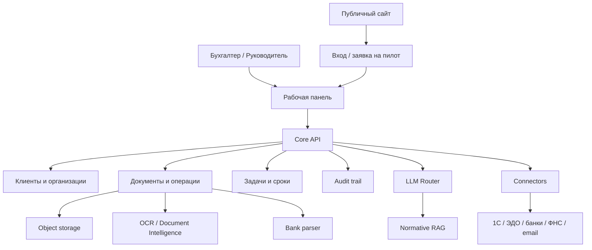
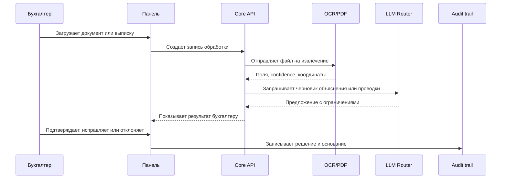

# Архитектура

## Архитектурная Идея

AI-Бухгалтер проектируется как модульная платформа, где ядро отвечает за
клиентов, документы, операции, задачи, роли и аудит, а тяжелые AI/OCR-задачи
вынесены за отдельные сервисные контракты.



```text
Публичный сайт
    |
    v
Рабочая панель бухгалтера
    |
    v
Core API: клиенты, документы, операции, задачи, аудит
    |
    +--> Хранилище метаданных
    +--> Объектное хранилище оригиналов
    +--> OCR / Document Intelligence
    +--> LLM Router / AI Gateway
    +--> Bank Parser
    +--> 1C / ЭДО / банки / ФНС / email
```

## Принципы

- Human-in-the-loop: AI не меняет учетные данные без подтверждения человека.
- Audit-first: существенные действия пишутся в журнал.
- Tenant isolation: данные разных компаний изолированы.
- Provider boundary: LLM, OCR и PDF-парсинг подключаются через контракты.
- Explainability: важные предложения имеют основание, уверенность и статус.
- Fail closed: при сбое AI система не должна тихо подставлять сомнительный
  результат.
- Privacy by design: документы и персональные данные требуют отдельного
  хранения, доступа, срока жизни и журналирования.

## Data Flow



## Целевые Компоненты

| Компонент | Назначение |
| --- | --- |
| Frontend | Публичный сайт, вход, рабочая панель бухгалтера |
| Core API | Клиенты, документы, операции, сверка, задачи |
| Auth | Сессии, роли, tenant context, MFA в production |
| Metadata DB | Структурные данные, статусы, связи, история |
| Object Storage | Оригиналы документов и файлов |
| OCR Service | Распознавание сканов и изображений |
| PDF Parser | Извлечение текста и таблиц из PDF-выписок |
| LLM Router | Провайдеры, лимиты, fallback, режимы стоимости |
| RAG | Версионируемые нормативные источники |
| Connectors | 1С, ЭДО, банки, ФНС, email, CRM |
| Observability | Логи, метрики, инциденты, качество AI |

## Пилотный Профиль

Для пилота допустим гибрид:

- Next.js и Vercel для публичного сайта и панели;
- отдельный OCR/PDF-сервис в контейнере;
- LLM через внешний API-провайдер;
- документная БД для метаданных;
- объектное хранилище для оригиналов на следующем этапе;
- реальные интеграции подключаются постепенно через sandbox-контракты.

## Production-Профиль

Для промышленного запуска нужны:

- постоянное хранилище оригиналов;
- резервные копии и restore tests;
- MFA и расширенные роли;
- журнал чтения чувствительных данных;
- политика хранения и удаления;
- изоляция клиентов и организаций;
- rate limits и защита от перегрузки OCR;
- наблюдаемость, incident runbook, release evidence;
- юридическая проверка обработки персональных данных.

## Почему Не Один Большой AI-Чат

Бухгалтерская работа требует доказуемости. Поэтому AI-Бухгалтер строится не
как чат, а как операционная система вокруг документов, операций и решений.

Чат может быть интерфейсом, но основа продукта — данные, статусы, задачи,
подтверждения, источники и аудит.
